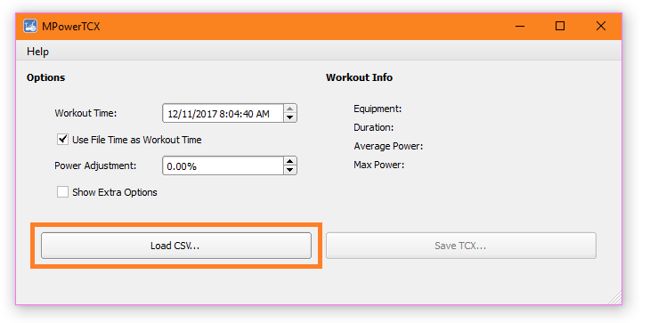
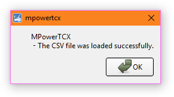
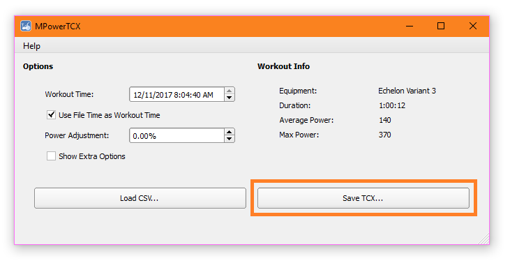
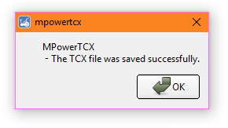

# How to use MPowerTCX

## Getting the CSV Data
1. Insert the USB thumb drive into the slot at the top of the console
1. Work out
1. Stop pedalling
1. Press "AVG/MAX" for 5 seconds
1. The USB logo will flash a few times. Wait for the flashing to stop and remove the drive
1. The removable drive should now contain a file named something like MPower1.csv

### Extra Help for Schwinn Products
* Youtube Tutorial - [Exporting Rider Data Onto A USB Drive](https://www.youtube.com/watch?v=ENkHdcV_E70)
* [Official Manuals and Updates](https://support.corehandf.com/Product/?brand=1)

## Problems with USB Thumb Drives
Some consoles reject or even crash when a newer model USB drive is used. A 1GB drive is your best bet.

If the USB logo fails to flash at the end of a ride, or the unit shuts off (crashes), you probably have an incompatible drive.

## Problems with Files
I only have one model of indoor bike. It's possible that your bike produces a different file format.

If your file doesn't work, feel free to send it my way.

## Converting your workout file to TCX

### Step 1 - Click "Load CSV..." to select your workout file

### Step 2 - If the file loads correctly, you will see this

### Step 3 - Adjust and click "Save TCX..." 

In this example the power meter on the bike reads too high by about 4%. The power values are adjusted down by using a negative value. 

By default, the workout time will be set to the timestamp on the CSV file. If you want to set a custom time, uncheck "Use File Time as Workout Time" and adjust the time.

### Step 4 - Done. Now you have a TCX file.

#### [(Back to the Main Page)](README.md)
