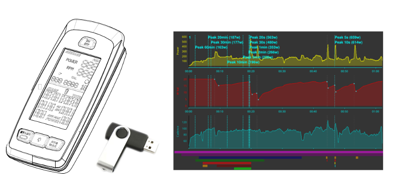
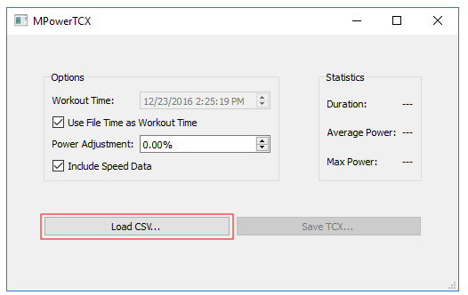
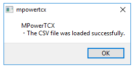
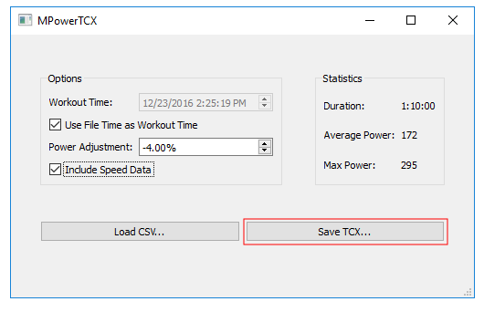
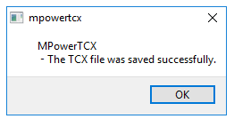

# MPowerTCX
Share Schwinn A.C. indoor cycle data with Strava, GoldenCheetah and other apps

## What it Does
This software converts the CSV data produced by MPower Echelon2 consoles to TCX format.

The TCX file can then be uploaded to Strava, imported into GoldenCheetah or used with any number of other 
applications that support TCX.

### Downloads

Find the latest releases here: https://github.com/j33433/MPowerTCX/releases

### Support

Contact j33433@gmail.com

### Supported Fields
1. Power (watts)
1. Cadence
1. Heart Rate
1. Speed (as estimated by Schwinn)

## Getting the MPower CSV Data
1. Insert the USB thumb drive into the slot at the top of the MPower unit
1. Spin so hard you break the pedals off!
1. Stop pedalling
1. Press "AVG/MAX" for 5 seconds
1. The USB logo will flash a few times. Wait for the flashing to stop and remove the drive
1. The removable drive should now contain a file named something like MPower1.csv

## Problems with USB Thumb Drives
This MPower Console appears to reject or even crash when a newer model USB drive is used. A 1GB drive is your best bet.

If the USB logo fails to flash at the end of a ride, or the unit shuts off (crashes), you probably have an incompatible drive.

## Problems with Files
I only have one model of indoor bike. It's possible that your bike produces a different file format.

If you file doesn't work, feel free to send it my way.

## Use

### Step 1 - Click "Load CSV..." to select your workout file

### Step 2 - If the file loads correctly, you will see this

### Step 3 - Adjust and click "Save TCX..." 

In this example the power meter on the bike reads too high by about 4%. The power values are adjusted down by using a negative value. 

By default, the workout time will be set to the timestamp on the CSV file. If you want to set a custom time, uncheck "Use File Time as Workout Time" and adjust the time.

### Step 4 - Done. Now you have TCX file.

## Project Queue
1. Convert Echelon 1 file format
